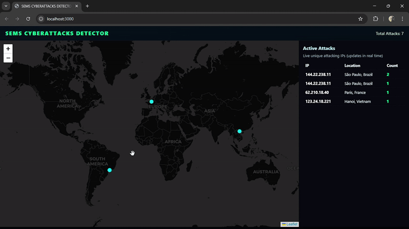

🛡️ CyberEye  
**Real-time Cyber Attack Detection & Monitoring**
CyberEye is a live cyber attack detection and visualization tool. It uses geolocation data and security intelligence to track and display potential threats in real time, giving security teams clear situational awareness.

## 🚀 Features
- **Real-time Threat Monitoring** — Detect and log incoming suspicious activities.
- **GeoIP Mapping** — Identify the origin of attacks using the MaxMind GeoLite2 database.
- **Backend API** — Built with Node.js & Express for handling detection logic.
- **Frontend Dashboard** — Live visualizations for quick decision-making.
- **Extensible Design** — Easily integrate with other tools or datasets.

